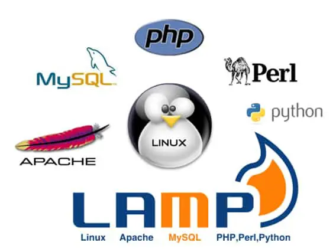
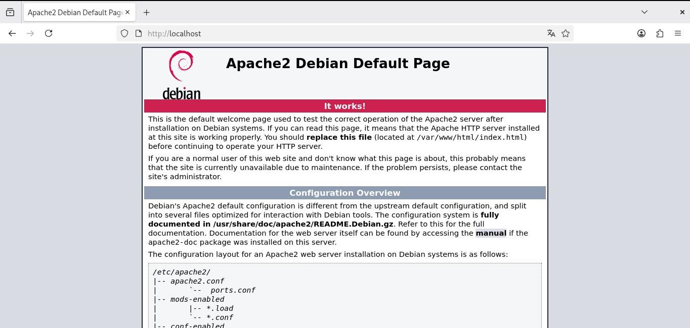
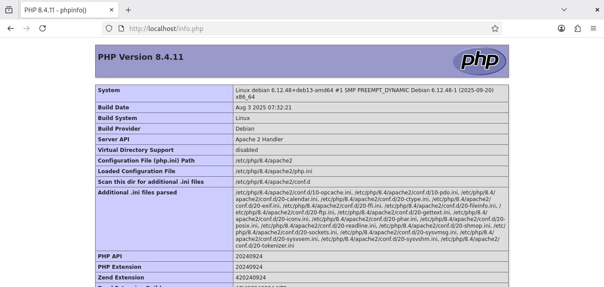
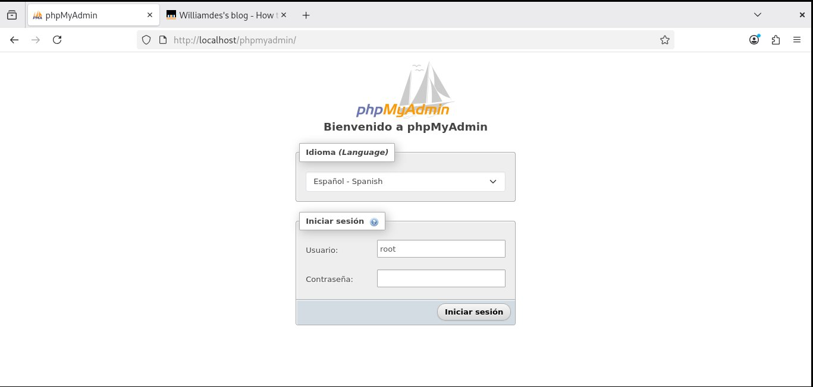
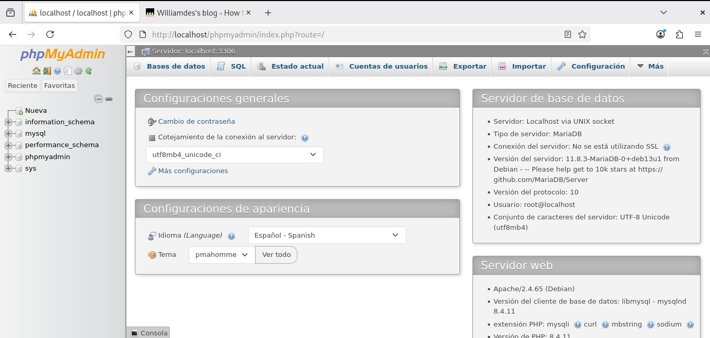

<p align="center">

</p>

# Contenido
- [Instalación de stack LAMP a través de paquetería](#instalación-de-stack-lamp-a-través-de-paquetería)
- [Instalación XAMPP en Windows](#instalación-xampp-en-windows)
- [LAMP usando Docker](#lamp-usando-docker)
- [Servidor web ligero integrado en PHP](#servidor-integrado-de-php)

# Instalación de stack LAMP a través de paquetería

```bash
sudo apt install apache2 php8.4
```
Ahora vamos a [http://localhost](http://localhost)



La carpeta **html** utilizada por Apache en Debian en **/var/www/html**

Para ver si PHP está instalado correctamente crearemos un fichero info.php en esta carpeta:

```php
<?php
phpinfo();
?>
```

Ahora vamos a [http://localhost/info.php](http://localhost/info.php)



Si queremos instalar MariaDB y phpmyadmin
```bash
sudo apt install phpmyadmin
```
```bash
sudo apt install mariadb-server
```
```bash
sudo dpkg-reconfigure phpmyadmin
```
Una vez configurado para poder usar como **root** en la base de datos, ejecutamos:
```bash
su
mariadb
```
Cambiamos la contraseña dentro de la base de datos para root:

```sql
SET PASSWORD FOR root@localhost = PASSWORD('new_password');
```




[Ver blog](https://blog.williamdes.eu/Debian/tutorials/how-to-install-phpmyadmin-on-debian-13-trixie/)

# Instalación XAMPP en Windows

- Descargamos XAMPP para Windows: [Enlace](https://sourceforge.net/projects/xampp/files/XAMPP%20Windows/8.2.12/xampp-windows-x64-8.2.12-0-VS16-installer.exe/download)
- Instalamos en C:\
- Iniciamos en servicio desde el Panel de Control de XAMPP
- Accedemos a [http://localhost](http://localhost)

La carpeta que utiliza XAMPP para guardar los ficheros es **c:\xampp\htdocs**

# LAMP usando Docker

## Solo Apache + PHP

Si sólo queremos instalar Apache con PHP podemos ejecutar este comando de Docker:
```bash
mkdir www 
cd www
docker run -d -p 8080:80 --name my-apache-php-app -v "$PWD":/var/www/html php:8.4-apache
```

La carpeta que utilizará el contenedor para será **www**. En esta carpeta tenermos que tener los ficheros que el servidor va a mostrar.

Para ver si PHP está instalado correctamente crearemos un fichero info.php en esta carpeta:
```php
<?php
phpinfo();
?>
```

ℹ️ **Información**: Tenemos que ajustar el puerto y el nombre del contenedor

## Apache + PHP + MySQL + Adminer

Para poder usar MySQL (MariaDB) y Adminer como GUI para acceder a la base de datos vía web la forma más cómoda sería usando Docker Compose. El fichero **docker-compose.yml** sería:

```yaml
   version: '3.1'

   services:

   apache-php:
      image: php:8.2-apache
      restart: always
      ports:
         - 8080:80
      volumes:
         - ${PWD}/html:/var/www/html
   db:
      image: mariadb
      restart: always
      ports:
         - 3306:3306
      environment:
         MARIADB_ROOT_PASSWORD: example

   adminer:
      image: adminer
      restart: always
      ports:
         - 8081:8080
```

Las credenciales para poder accceder a MariaDB sería usuario **root** y password **example**. El password puede cambiarse en el fichero. La interfaz de Adminer sería accesible en el puerto **8080**, y también puede cambiarse.

---

# Servidor web ligero integrado en PHP

Es un **servidor web ligero integrado en PHP** (disponible desde PHP 5.4).  
La `-S` viene de **"Server"**.

> ⚠️ **Importante**:  
> **NO está pensado para producción**. Solo para **desarrollo y pruebas locales**.

---

## ▶️ Cómo usarlo

### Sintaxis básica:
```bash
php -S dirección:puerto
```

### Ejemplo más común:
```bash
php -S localhost:8000
```

Esto inicia un servidor web en `http://localhost:8000` y sirve los archivos del **directorio actual**.

---

## 📁 Especificar una carpeta raíz

Si quieres servir archivos desde una carpeta específica (por ejemplo, `public/`):

```bash
php -S localhost:8000 -t public/
```

- `-t` indica el **document root** (directorio raíz del sitio web).

---

## 🧪 Ejemplo paso a paso

1. **Crea una carpeta de proyecto**:
   ```bash
   mkdir mi-app
   cd mi-app
   ```

2. **Crea un archivo `index.php`**:
   ```php
   <?php
   echo "<h1>¡Hola desde el servidor integrado de PHP!</h1>";
   echo "<p>Hora actual: " . date('H:i:s') . "</p>";
   ?>
   ```

3. **Inicia el servidor**:
   ```bash
   php -S localhost:8000
   ```

4. **Abre tu navegador** en:  
   → [http://localhost:8000](http://localhost:8000)

   Verás la página PHP ejecutada correctamente.

---

## 📄 Soporte de archivos estáticos

El servidor también sirve:
- Archivos `.html`, `.css`, `.js`, imágenes, etc.
- Si pides `/estilo.css`, sirve el archivo `estilo.css` si existe.

> ✅ Ideal para probar aplicaciones web completas (HTML + CSS + JS + PHP) en local.

---

## 🧩 Archivo de enrutamiento (opcional)

Puedes usar un **script de enrutamiento** para simular reglas de URL (útil en aplicaciones con enrutamiento personalizado):

```bash
php -S localhost:8000 router.php
```

Dentro de `router.php`, puedes decidir qué archivo servir:
```php
<?php
// router.php
if (file_exists($_SERVER["REQUEST_URI"])) {
    return false; // sirve el archivo directamente
} else {
    include 'index.php'; // enrutamiento personalizado
}
?>
```

> 🔧 Esto es útil para emular comportamientos de Apache/Nginx en desarrollo.

---

## 🛠️ Casos prácticos

| Escenario | Comando |
|---------|--------|
| Probar una página PHP simple | `php -S localhost:8000` |
| Probar una app con carpeta `public/` | `php -S localhost:8000 -t public/` |
| Mostrar a alumnos cómo funciona un servidor web | `php -S 0.0.0.0:8000` (accesible en red local) |
| Depurar sin instalar Apache | Ideal para sesiones de clase rápidas |

---

## ⚠️ Limitaciones

| Característica | ¿Soportado? | Notas |
|---------------|------------|------|
| **.htaccess** | ❌ No | No interpreta reglas de Apache |
| **Módulos PHP** | ✅ Sí | Usa la configuración de tu PHP CLI |
| **Varios sitios virtuales** | ❌ No | Solo un document root |
| **Rendimiento** | ❌ Bajo | Solo para desarrollo |
| **Acceso remoto** | ✅ Con `0.0.0.0` | `php -S 0.0.0.0:8000` permite acceso desde otras máquinas en la red local |

> 📝 **En producción, siempre usa Apache o Nginx**.

---

## 🔐 Seguridad

- Por defecto, el servidor solo escucha en `localhost` → no es accesible desde Internet.
- Si usas `0.0.0.0`, **solo en redes de confianza** (aula, red local segura).
- Nunca uses este servidor en un entorno público o con datos sensibles.

---

## 💡 Consejos
- Esta opción es recomendable para hacer pruebas
- Tiene limitaciones 

# Configuración de PHP
