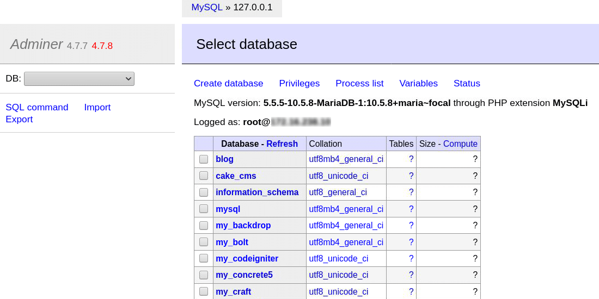

# Acceso a BBDD

## Configuración de MySQL/MaríaDB

### Con XAMPP
XAMPP viene con un base de datos MySQL/MariaDB por lo que lo único que tenemos que hacer es iniciarla desde el panel de control cuando queramos usarla. Además en XAMPP está incluida la interfaz de PhpMyAdmin, accesible desde [http://localhost/phpmyadmin](http://localhost/phpmyadmin)

## Interfaces de gestión para MySQL/MariaDB

### PhpMyAdmin
**PhpMyAdmin** es la interfaz web más completa para trabajar con bases de datos MySQL/MariaDB. 

### Adminer
**Adminer** es otra interfaz web para trabajar con bases de datos MySQL/MariaDB con las funcionalidades básicas. La interfaz es más básica que la de **PhpMyAdmin**, pero se trabaja más rápido para realizar las operaciones básicas.



## Usando Docker Compose
La forma más sencilla de iniciar una base de datos en Linux es usando Docker Compose mediante un fichero de configuración **docker-compose.yml**. Con este método iniciaremos tanto la base de datos como la interfaz de **Adminer**.

Para ello creamos una carpeta con el nombre **bbdd**, y dentro creamos el fichero **docker-compose.yml**

```yml
version: '3.1'

services:

  db:
    image: mariadb
    restart: always
    ports:
      - 3308:3306
    environment:
      MARIADB_ROOT_PASSWORD: example

  adminer:
    image: adminer
    restart: always
    ports:
      - 8080:8080
```

Ejecutamos el comando dentro de la carpeta:
```bash
docker-compose up
```

Cuando iniciemos con Docker Compose el creará los contenedores automáticamente con los datos especificados en el fichero de configuración. El usuario por defecto es **root**. Podemos cambiar los puertos y la contraseña.


## Librería DB
Esta librería nos permitirá realizar la principales operaciones sobre bases de datos de una forma sencilla, sin tener que usar las funciones que incluye PHP.

### Configuración
Para que la librería funcione correctamente tenemos que definir previamente las siguientes constantes:
- **DB_TYPE:** mysql
- **DB_HOST**: Nombre o dirección del host del servidor MySQL/MariDB
- **DB_NAME**: Nombre de la base de datos
- **DB_USER**: Usuario
- **DB_PASS**: Contraseña
- **DB_PORT**: Por defecto poner 3306

Lo más adecuado es crear un fichero **config.php** con estas constantes y luego incluirlo en antes de usar la librería.

```php
<?php
// Datos de configuración de la base de datos
define('DB_TYPE', 'mysql');
define('DB_HOST', '127.0.0.1'); 
define('DB_USER', 'root');
define('DB_PASS', 'example');
define('DB_NAME', 'personas');
define('DB_PORT', 3306);
```

### Abrir conexión

### Realizar una consulta (QUERY)

### Insertar un registro (INSERT)

### Actualizar un registro (UPATE)

### Borrar un registro (DELETE)

### Cerrar conexión

